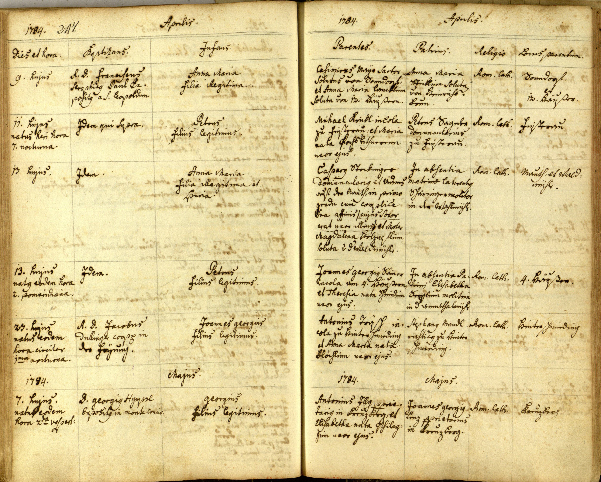
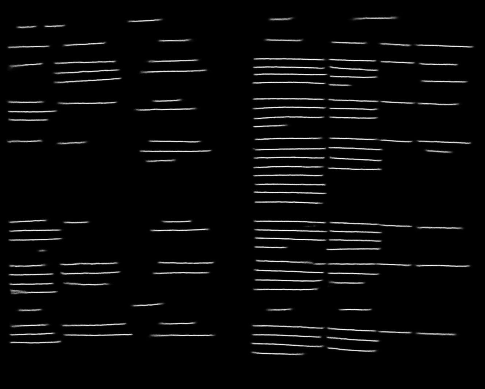
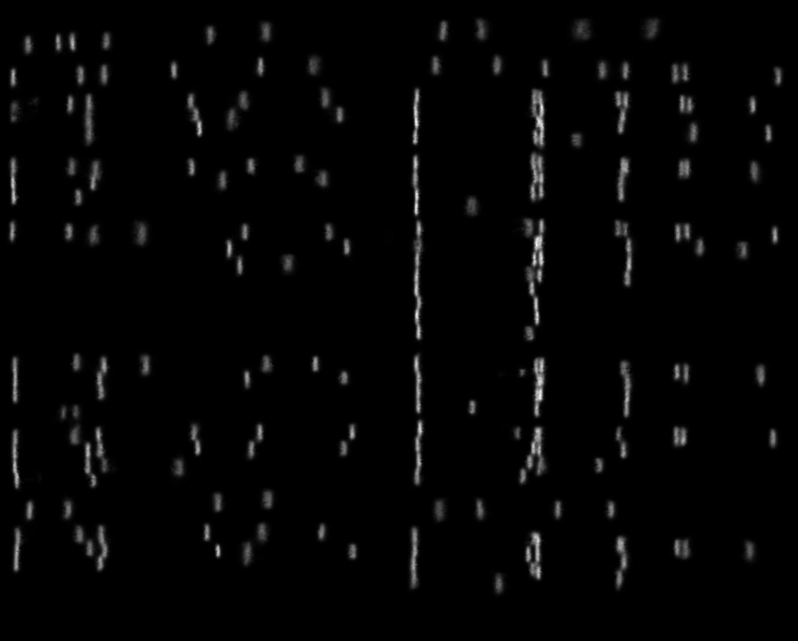

# ARU-Net: A Neural Pixel Labeler for Layout Analysis of Historical Documents

## Contents
* [Introduction](#introduction)
* [Installation](#installation)
* [Demo](#demo)
* [Training](#training)

## Introduction 
This is the Tensorflow code corresponding to [A Two-Stage Method for Text Line Detection in Historical Documents
](#a-two-stage-method-for-text-line-detection-in-historical-documents). This repo contains the neural pixel labeling part described in the paper.
It contains the so-called ARU-Net (among others) which is basically an extended version of the well known U-Net [[2]](#u-net-convolutional-networks-for-biomedical-image-segmentation). 
Besides the model and the basic workflow to train and test models, different data augmentation strategies are implemented to reduce the amound of training data needed.
The repo's features are summarized below:
+ Inference Demo
    + Trained and freezed tensorflow graph included
    + Easy to reuse for own inference tests
+ Workflow 
    + Full training workflow to parametrize and train your own models
    + Contains different models, data augmentation strategies, loss functions 
    + Training on specific GPU, this enables the training of several models on a multi GPU system in parallel
    + Easy validation for trained model either using classical or ema-shadow weights

Please cite [[1]](#a-two-stage-method-for-text-line-detection-in-historical-documents) if you find this repo useful and/or use this software for own work.


## Installation
1. Use python 2.7
2. Any version of tensorflow version > 1.0 should be ok.
3. Python packages: matplotlib (>=1.3.1), pillow (>=2.1.0), scipy (>=1.0.0), scikit-image (>=0.13.1), click (>=5.x)
4. Clone the Repo
5. Done

## Demo
To run the demo follow:
1. Open a shell
2. Make sure Tensorflow is available, e.g., go to docker environment, activate conda, ... 
3. Navigate to the repo folder YOUR_PATH/ARU-Net/
4. Run:
```
python run_demo_inference.py 
```

The demo will load a trained model and perform inference for five sample images of the cBad test set [[3]](#read-bad-a-new-dataset-and-evaluation-scheme-for-baseline-detection-in-archival-documents), 
[[4]](#scriptnet-icdar-2017-competition-on-baseline-detection-in-archival-documents-cbad).
The network was trained to predict the position of baselines and separators for the begining and end of each text line.
After running the python script you should see a matplot window. To go to the next image just close it.

### Example
The example images are sampled from the cBad test set [[3]](#read-bad-a-new-dataset-and-evaluation-scheme-for-baseline-detection-in-archival-documents), 
[[4]](#scriptnet-icdar-2017-competition-on-baseline-detection-in-archival-documents-cbad). One image along with its results are shown below.






## Training
This section describes step-by-step the procedure to train your own model.

### Train data: 
The following describes how the training data should look like:
+ The images along with its pixel ground truth have to be in the same folder
+ For each image:  X.jpg, there have to be images named X_GT0.jpg, X_GT1.jpg, X_GT2.jpg, ... (for each channel to be predicted one GT image)
+ Each ground truth image is binary and contains ones at positions where the corresponding class is present and zeros otherwise (see demo_images/demo_traindata for a sample)
+ Generate a list containing row-wise the absolute pathes to the images (just the document images not the GT ones)

### Val data:
The following describes how the validation data should look like:
+ See [train data](#train-data)

### Train the model:
The following describes how to train a model:
+ Have a look at the pix_lab/main/train_aru.py script
+ Parametrize it like you wish (have a look at the data_provider, cost and optimizer scripts to see all parameters)
+ Setting the correct paths, adapting the number of output classes and using the default parametrization should work fine for a first training
+ Run:
```
python -u pix_lab/main/train_aru.py &> info.log 
```

### Validate the model:
The following describes how to validate a trained model:
+ Train and val losses are printed in info.log
+ To validate the checkpoints using the classical weights as well as its ema-shadows, adapt and run: 
```
pix_lab/main/validate_ckpt.py
```

## Comments 
If you are interested in a related problem, this repo could maybe help you as well.
The ARU-Net can be used for each pixel labeling task, besides the baseline detection task, it can be easily used for, e.g., binarization, page segmentation, ... purposes.

    
## References

Please cite [[1]](#a-two-stage-method-for-text-line-detection-in-historical-documents) if using this code.

### A Two-Stage Method for Text Line Detection in Historical Documents

[1] T. Grüning, G. Leifert, T. Strauß, R. Labahn, [*A Two-Stage Method for Text Line Detection in Historical Documents*](https://arxiv.org/abs/1802.03345)

```
@article{Gruning2018,
arxivId = {1802.03345},
author = {Gr{\"{u}}ning, Tobias and Leifert, Gundram and Strau{\ss}, Tobias and Labahn, Roger},
title = {{A Two-Stage Method for Text Line Detection in Historical Documents}},
url = {http://arxiv.org/abs/1802.03345},
year = {2018}
}
```

### U-Net: Convolutional Networks for Biomedical Image Segmentation

[2] O. Ronneberger, P, Fischer, T, Brox, [*U-Net: Convolutional Networks for Biomedical Image Segmentation*](https://arxiv.org/abs/1505.04597)
 ```
@article{Ronneberger2015,
arxivId = {1505.04597},
author = {Ronneberger, Olaf and Fischer, Philipp and Brox, Thomas},
journal = {Miccai},
pages = {234--241},
title = {{U-Net: Convolutional Networks for Biomedical Image Segmentation}},
year = {2015}
}
```

### READ-BAD: A New Dataset and Evaluation Scheme for Baseline Detection in Archival Documents

[3] T. Grüning, R. Labahn, M. Diem, F. Kleber, S. Fiel, [*READ-BAD: A New Dataset and Evaluation Scheme for Baseline Detection in Archival Documents*](https://arxiv.org/abs/1705.03311)

```
@article{Gruning2017,
arxivId = {1705.03311},
author = {Gr{\"{u}}ning, Tobias and Labahn, Roger and Diem, Markus and Kleber, Florian and Fiel, Stefan},
title = {{READ-BAD: A New Dataset and Evaluation Scheme for Baseline Detection in Archival Documents}},
url = {http://arxiv.org/abs/1705.03311},
year = {2017}
}
```

### A Robust and Binarization-Free Approach for Text Line Detection in Historical Documents

[4] M. Diem, F. Kleber, S. Fiel, T. Grüning, B. Gatos, [*ScriptNet: ICDAR 2017 Competition on Baseline Detection in Archival Documents (cBAD)*](https://zenodo.org/record/257972)
 
```
@misc{Diem2017,
author = {Diem, Markus and Kleber, Florian and Fiel, Stefan and Gr{\"{u}}ning, Tobias and Gatos, Basilis},
doi = {10.5281/zenodo.257972},
title = {ScriptNet: ICDAR 2017 Competition on Baseline Detection in Archival Documents (cBAD)},
year = {2017}
}
```
    
